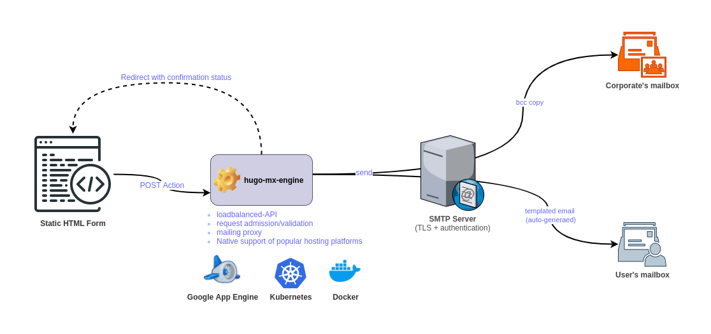
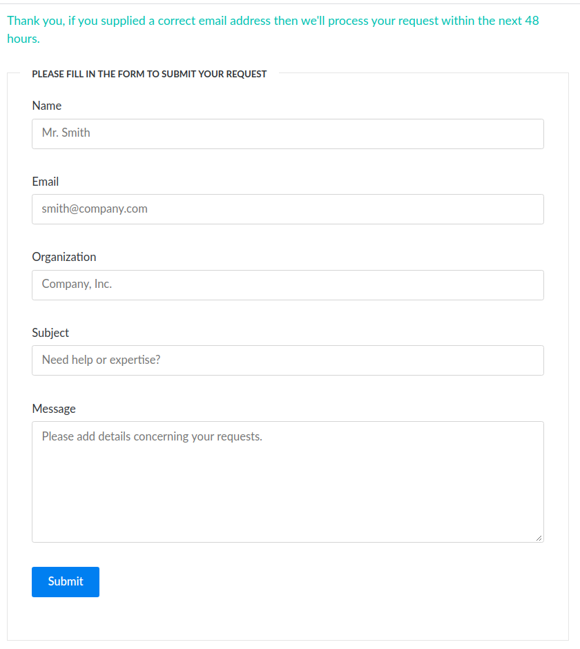

[](https://github.com/rchakode/`hugo-mx-gateway`/actions)


# Overview
In a nutshell, `hugo-mx-gateway` provides a RESTful POST endpoint for static contact/demo request pages. It's a simple, yet a powerful tool built for this only-designated purpose.

**This project is at its early open source life, but with a production deployment. The documentation is still being refining (notably for wording and typos). Contributions is any form (code/docs/ideas...) are welcomed.** 



# Table of contents
- [Overview](#overview)
- [Table of contents](#table-of-contents)
- [Why hugo-mx-gateway](#why-hugo-mx-gateway)
  - [How does it work](#how-does-it-work)
  - [Prerequisites](#prerequisites)
- [Deployment](#deployment
  - [Deployment on Google App Engine](#deployment-on-google-app-engine)
  - [Deployment on a Kubernetes cluster](#deployment-on-a-kubernetes-cluster)
  - [Deployment on Docker](#deployment-on-docker)
- [Use the built-in form for Hugo](#use-the-built-in-form-for-hugo)
- [Configuration variables](#configuration-variables)
- [License & Copyrights](#license--copyrights)
- [Support & Contributions](#support--contributions)


# Why hugo-mx-gateway
Did you ever experience building a static website (e.g. using [Hugo](https://gohugo.io/) or whatever alternative), then did get stuck when coming the time to add a contact/demo request form?

You're at the right place.

This project, namely `hugo-mx-gateway`, is meant to provide a RESTful API that adds the dynamicity required to handle contact/demo requests for static web sites. It's a simple, yet a powerful tool built for this only-designated purpose.



## How does it work
`hugo-mx-gateway` is built upon a simple request handling workflow:

* Create an HTML form with a POST action pointing towards the `hugo-mx-gateway` service. This service is a RESTful POST endpoint backed by an application easily deployable on [Google App Engine](https://cloud.google.com/appengine), Kubernetes, or Docker.
* For each user request, `hugo-mx-gateway` automatically retrieves information submitted by the user (email, subject, message details...), then **generates and sends** a **templated email** to the user-provided email address, while **bcc**ing a copy of that email to an address that you can define for internal tracking and follow up.
* Once a request is processed (upon success or failure), `hugo-mx-gateway` handles the reply back towards the calling static page by redirecting the browser to the origin page with additional URL parameters describing the completion status of the processing (e.g. `/contact.html?status=success&message=request%20submitted`). The parameters can then be easily retrieved and shown to the user, e.g. with a few lines of Javascript within the static page.
* The project is shipped with a sample HTML form intending to cover a basic use case of contact and demo requests. That said, this is a open source software, so you're free to adapt it for your specific use cases.

## Prerequisites
`hugo-mx-gateway` is easily deployable in minutes, subject to fulfil the following requirements:

* Deployment platform (at your choice): Google App Engine, Kubernetes, or Docker. 
* An SMTP account with the server supporting TLS. 

These are basic requirements in the today's Internet world.

> While it can be tempting to use a personal email account, it's highly recommended for security and privacy reasons not do that for an internet-hosted service. Therefore, according to your situation, you may need to ask for an SMTP account to your corporate's IT staff. If you're free to take the decision, you can opt for a cloud-based SMTP service like SendGrid, Mailgun, and Mailjet--they all offer free tier for small usage.

# Deployment
Consider one of the following resources according to the selected installation platform.

## Deployment on Google App Engine
This requires to have an active GCP account and [Google Cloud SDK](https://cloud.google.com/sdk) (gcloud) installed on your work station.

* Create/select a GCP project to deploy `hugo-mx-gateway`. 
  
  Note that each GCP project can hold only a single App Engine instance. Several applications can be co-hosted as services for the root App Engine instance. In this case, a new application has to be declared as `service` in the `app.yaml` file.
* Create the Google App Engine configuration file 
  ```
  cp app.yaml.sample app.yaml
  ```
* Open the `app.yaml` file with your favorite editor.
* Edit the configuration variables as described [here](#configuration-variables).
* Start the deployment
  ```
  make deploy-gcp
  ```
* Check that `hugo-mx-gateway` is up and functioning
  ```
  curl https://PROJECT-ID.REGION.r.appspot.com/healthz 
  ```
  Replace `PROJECT-ID` with the GCP project ID, and `REGION` with the deployment region.

## Deployment on a Kubernetes cluster
There is a [Helm chart](./helm/) to ease the deployment on Kubernetes clusters. 

> **Important:** The chart is validated with Helm 3 and the pod is run in an unprivileged mode within a **Security Context**.

Proceed with the deployment as follows:

* First edit the [values.yaml](./helm/values.yaml) file to set [configuration values](#configuration-variables) appropriately.
* Choose a deployment namespace. In the sample commands provided hereafter, it's assumed that the target namespace is `hugo-mx-gateway`. If you opt for another namespace, do consider to adapt the commands accordingly.
* Apply the deployment with Helm
  ```
  helm upgrade \
    --namespace hugo-mx-gateway \
    --install hugo-mx-gateway \
    helm/
  ```

* Check that the application is up and running.
  ```
  kubectl -n hugo-mx-gateway port-forward service/hugo-mx-gateway 8080:80
  curl https://127.0.0.1:8080/healthz 
  ```

## Deployment on Docker
An instance of `hugo-mx-gateway` can be quickly started on any machine running Docker.

* Please first review the [configuration variables](#configuration-variables) and adapt them appropriately. 

* Then apply the following command:

  ```
  $ docker run -d \
    --publish 8080:8080 \
    --name '`hugo-mx-gateway`' \
    -e SMTP_SERVER_ADDR="smtp.example.com:465" \
    -e SMTP_VERITY_CERT=true \
    -e SMTP_CLIENT_USERNAME="postmaster@example.com" \
    -e SMTP_CLIENT_PASSWORD="postmasterSecretPassWord" \
    -e CONTACT_REPLY_EMAIL="noreply@example.com" \
    -e CONTACT_REPLY_BCC_EMAIL="contact@example.com" \
    -e DEMO_URL="https://demo.example.com/" \
    -e ALLOWED_ORIGINS="127.0.0.1,example.com" \
    rchakode/`hugo-mx-gateway`
  ```

* Check that the container is up and functionning.

  ```
  curl https://127.0.0.1:8080/healthz 
  ```

# Use the built-in form for Hugo
The file `./samples/hugo-partial-contact-form.html` contains a sample HTML form for Hugo. It can be used for both contact and demo requests.

Open the file in a your favorite editor and review it.

Notice that the form is configured to be rendered specifically according to a Hugo parameter named **tags**, which is actually a **list of tags**. If the parameter holds a tag named `contact` then, the form will be rendered as a contact form. Otherwise, it'll be rendered as a demo form.

The integration works as follows:
 * Copy the HTML form content in your target **Hugo HTML template**. 
 * Modify the `<form>` tag to make the **action** point to the URL of the sendmail backend deployed previously.
   * On Google App Engine, the endpoint shall be: https://PROJECT-ID.REGION.r.appspot.com/sendmail. Replace `PROJECT-ID` and `REGION`, repectively, with the GCP's project ID and the deployment region.
   * On Kubernetes, the in-cluster endpoint shall be: http://`hugo-mx-gateway`.`hugo-mx-gateway`.svc.cluster.local/sendmail
   * On Docker, the endpoint shall be: http://DOCKER-HOST:8080/sendmail. Replace `DOCKER-HOST` with the IP adress or the hostname of the Docker machine.
 * Edit the **Hugo Markdown content** of the target contact/demo page to ensure that the **tags** parameter holds a appropriate value (i.e. `contact` for a contact form, or `demo` for a demo request form).

Here is an example of header for a Hugo Markdown page. The `tags` parameter holds a tag named `contact`) meaning that the page will be rendered as a contact request form.

  ```
  ---
  title: "Contact Us"
  description: "Contact request page"
  date: 2020-04-25T00:20:27+02:00
  tags: [contact]
  ---
  ```


# Configuration variables
Regardless of the deployment platform (Google App Engine, Kubernetes, Docker), the following configuration parameters must be provided as environment variables:

* `SMTP_SERVER_ADDR`: Set the address of the SMTP server in the form of `host:port`. It's required that the SMTP server being supporting TLS.
* `SMTP_VERITY_CERT`: Tell whether the SMTP certificate should be validated against top level authorities. If you're using a self-signed certificate on the SMTP server, this value must be set to `false`.
* `SMTP_CLIENT_USERNAME`: Set the username to connect to the SMTP server.
* `SMTP_CLIENT_PASSWORD`: Set the password to connect to the SMTP server.
* `CONTACT_REPLY_EMAIL`: Set an email address for the reply email. It's not necessary a valid email address, for example if don't want the user to reply you can use something like `noreply@example.com`.
* `CONTACT_REPLY_BCC_EMAIL`: Sets an email address for bcc copy of the email sent to the user. This is useful for tracking and follow up.
* `DEMO_URL`: Specific for demo forms, it can be used to set the URL of the demo site that will be included to the user reply email (e.g. `https://demo.example.com/`). 
* `ALLOWED_ORIGINS`: Set a list of comma-separated domains that the `hugo-mx-gateway` App shoudl trust. This is for security reason to filter requests. Only requests with an `Origin` header belonging to the defined origins will be accepted, through it's only required that the request has a valid `Referer` header. It's expected in the future to these request filtering and admission rules.
* `TEMPLATE_DEMO_REQUEST_REPLY` (optional): Specify the path of the template to reply a demo request. The default templare is `templates/template_reply_demo_request.html`
* `TEMPLATE_CONTACT_REQUEST_REPLY` (optional): Specify the path of the template to reply a contact request. The default templare is `templates/template_reply_contact_request.html`.

# License & Copyrights
This tool (code and documentation) is licensed under the terms of Apache 2.0 License. Read the [LICENSE](LICENSE) file for more details on the license terms.

The tool may inlcude third-party libraries provided with their owns licenses and copyrights, but always compatible with the Apache 2.0 License terms of use.

# Support & Contributions
We encourage feedback and do make our best to handle any troubles you may encounter when using this tool.

Here is the link to submit issues: https://github.com/rchakode/`hugo-mx-gateway`/issues.

New ideas are welcomed, please open an issue to submit your idea if you have any one.

Contributions are accepted subject that the code and documentation be released under the terms of Apache 2.0 License.

To contribute bug patches or new features, please use the Github Pull Request model.
