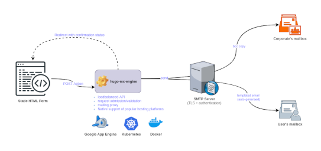

---

- [Overview](#overview)
- [Getting Started](#getting-started)
- [License & Copyrights](#license--copyrights)
- [Support & Contributions](#support--contributions)

# Overview
Did you ever experience building a static website (e.g. using [Hugo](https://gohugo.io/)) then got stuck when coming the time to add a contact/demo request form?

You're at the right place.

`hugo-mx-gateway` provides a RESTful API that adds the dynamicity required to handle contact/demo requests for your static websites. It's a simple, yet a powerful tool built for this only-designated purpose.

# Getting Started
The following resources will enable you to deploy and get started with hugo-mx-gateway.

* [Deployment on Kubernetes](./docs/deployment-on-kubernetes.md)
* [Deployment on Google Compute Engine](./docs/deployment-on-google-compute-engine.md)
* [Deployment on Docker](./docs/deployment-on-docker.md)
* [Deployment on Debian](./docs/deployment-on-debian.md)
* [Configuration Variables](./docs/configuration-variables.md)
* [Sample contact form for Hugo](./docs/sample-contact-form-for-hugo.md)
* [Design Fundamentals](./docs/design-fundamentals.md)

# License & Copyrights
This tool (code and documentation) is licensed under the terms of Apache 2.0 License. Read the [LICENSE](LICENSE) file for more details on the license terms.

The tool may include third-party libraries provided with their own licenses and copyrights, but always compatible with the Apache 2.0 License terms of use.

# Support & Contributions
We encourage feedback and do make our best to handle any troubles you may encounter when using this tool.

Here is the link to submit issues: https://github.com/rchakode/hugo-mx-gateway/issues.

New ideas are welcomed, please open an issue to submit your idea if you have any one.

Contributions are accepted subject that the code and documentation be released under the terms of Apache 2.0 License.

To contribute bug patches or new features, please use the Github Pull Request model.
