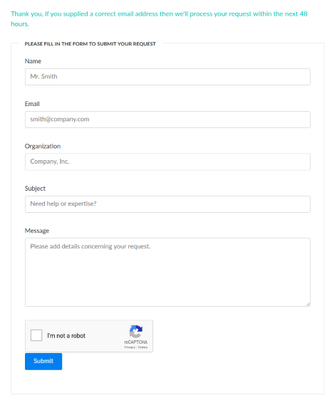

# Sample contact form for Hugo

From the source tree, the file `samples/hugo-partial-contact-form.html` contains a sample HTML form for Hugo (a screenshot is provided below). 

> This form can be used for a contact or a demo form. Indeed, as shown in the procedure below, the form is configured to be rendered specifically according to a tag set in the Hugo page content.



## Setup Procedure

* Copy the HTML form content in your target **Hugo HTML template**.
* Open the file in your favorite editor to update it. 
* Modify the `<form>` tag to make the **action** point it your hugo-mx-gateway sendmail backend URL (this URL depends on the deployment option: [Deployment on Kubenetes](./deployment-on-kubernetes.md), [Deployment on Google Computing Engine](./deployment-on-kubernetes.md), [Deployment on Docker](./deployment-on-kubernetes.md), [Deployment on Debian](./deployment-on-debian.md).
* Edit the **Hugo Markdown content** of the target contact/demo page to ensure that the **tags** parameter holds an appropriate value (i.e. `contact` for a contact form, or `demo` for a demo request form).

   ```
   ---
   title: "Contact Us"
   description: "Contact request page"
   date: 2020-04-25T00:20:27+02:00
   tags: [contact]
   ---
   ```